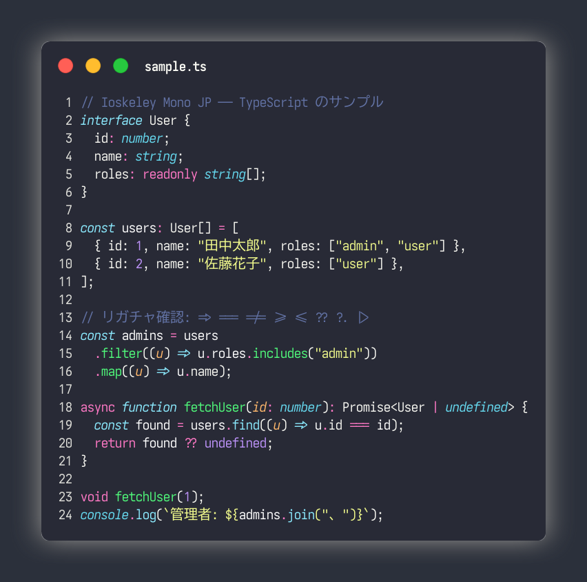
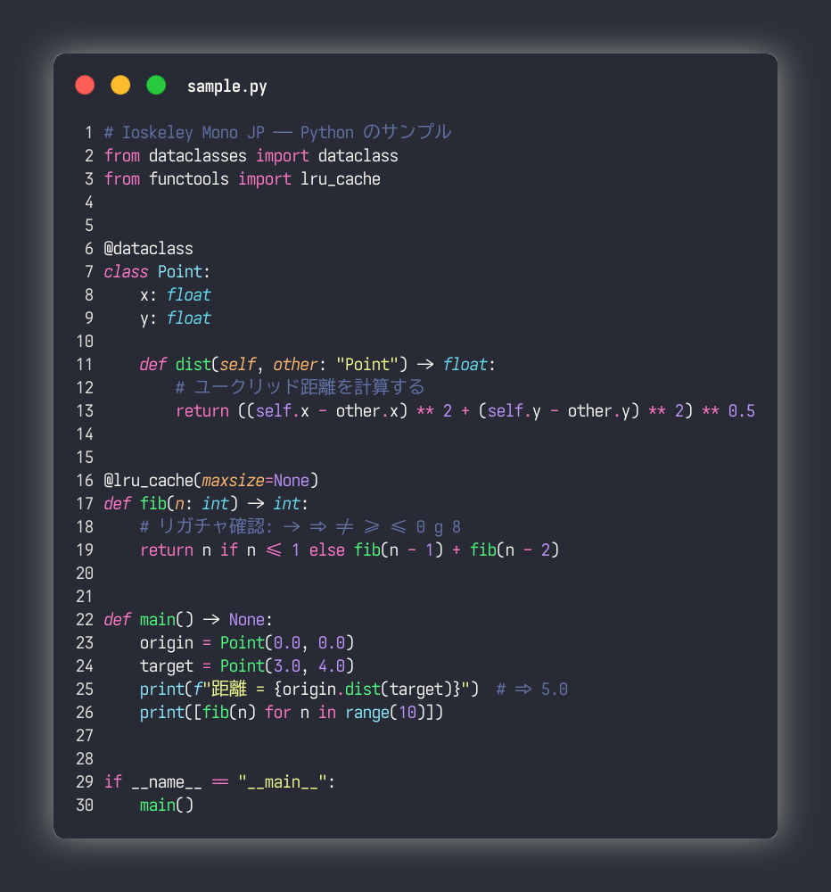

# Ioskeley Mono JP

<p align="center">
  
</p>

**Ioskeley Mono JP** は、日本語文字に [BIZ UDゴシック](https://github.com/googlefonts/morisawa-biz-ud-gothic)、英数字に [Ioskeley Mono](https://github.com/ahatem/IoskeleyMono) を使って合成した、プログラミング向けの日本語等幅フォントです。

[UDEV Gothic](https://github.com/yuru7/udev-gothic) の優れた合成基盤をベースに、英数字部分を JetBrains Mono から **Ioskeley Mono** に差し替えています。Ioskeley Mono は [Iosevka](https://github.com/be5invis/Iosevka) を [Berkeley Mono](https://berkeleygraphics.com/typefaces/berkeley-mono/) 風に構成した、幾何学的で締まりのある等幅フォントです。

> **合成の内訳**
> - 日本語・全角記号 ( `↑ □ ■ …` など) → **BIZ UDゴシック**
> - 英数字・ASCII 記号 → **Ioskeley Mono** (Iosevka)
> - アイコングリフ (NF版のみ) → **Nerd Fonts**

## 特徴

- モリサワ社のユニバーサルデザインフォント BIZ UDゴシック由来の、読みやすい日本語文字
- Berkeley Mono 風に調整された Ioskeley Mono 由来の、幾何学的で判読性の高い英数字
  - シングルストーリー `g`、ドットゼロ `0`、二重丸の `8`、角ばった約物ドットなど
- 半角1:全角2 と 半角3:全角5 の 2 種類の文字幅比率
- リガチャ **有効版 (LG)** と **無効版** の両方を収録
- [Nerd Fonts](https://www.nerdfonts.com/) 追加合成版 (NF) でターミナルのアイコン表示に対応
- 全角スペースの可視化 (不可視版 HS も用意)
- BIZ UDゴシック相当の IVS (異体字シーケンス) に対応

## コードサンプル

いずれも Nerd Fonts + リガチャ有効版 (`NFLG`) で描画しています。画像は [`scripts/generate-samples.sh`](./scripts/generate-samples.sh) で [silicon](https://github.com/Aloxaf/silicon) を使って生成しています。

### TypeScript

<p align="center">
  
</p>

### Python

<p align="center">
  
</p>

サンプルコードは [`scripts/samples/`](./scripts/samples/) にあります。画像を再生成するには、フォントをインストールした状態で以下を実行します。

```sh
./scripts/generate-samples.sh
```

## ダウンロード

[Releases ページ](../../releases/latest) から、用途に応じた zip をダウンロードしてください。

| ファイル | 内容 |
| --- | --- |
| `IoskeleyMonoJP_<ver>.zip` | 通常版。リガチャ無効(既定)／有効(`LG`)、幅比率 1:2／3:5(`35`)、日本語文書向け(`JPDOC`) を同梱。まずはこれ。 |
| `IoskeleyMonoJP_NF_<ver>.zip` | Nerd Fonts 版。ターミナル向けにアイコングリフを収録 (`NF` / `NFLG`)。 |
| `IoskeleyMonoJP_HS_<ver>.zip` | 全角スペース不可視版。全角スペースの可視化が煩わしい場合に。 |

### ファイル名の見方

`IoskeleyMonoJP<修飾子>-<スタイル>.ttf` の形式です。修飾子の組み合わせでバリアントが決まります。

| 修飾子 | 意味 |
| --- | --- |
| (無印) | 文字幅比率 半角1:全角2 |
| `35` | 文字幅比率 半角3:全角5 (英数字にゆとり) |
| `LG` | リガチャ **有効** ((無印) は無効) |
| `NF` | Nerd Fonts 収録 |
| `JPDOC` | 日本語文書で頻出する記号 ( `← ↓ ↑ → □ ■ …` など) を全角で表示 |
| `HS` | 全角スペースを不可視化 |

スタイルは `Regular` / `Bold` / `Italic` / `BoldItalic` の 4 種類です。

### インストール

1. zip をダウンロードして展開
2. 使いたい `.ttf` を選択
3. OS ごとにインストール:
   - **Windows** — 選択して右クリック → インストール
   - **macOS** — ダブルクリック → フォントをインストール
   - **Linux** — `~/.local/share/fonts/` にコピーして `fc-cache -fv`

### Nix

[Flake](./flake.nix) からフォントをインストールできます (Releases の zip を取得して展開します)。

```sh
# 一時的に試す
nix shell github:takeshiD/IoskeleyMonoJP

# プロファイルにインストール
nix profile install github:takeshiD/IoskeleyMonoJP          # 通常版
nix profile install github:takeshiD/IoskeleyMonoJP#ioskeley-mono-jp-nf  # Nerd Fonts 版
```

NixOS / home-manager では `fonts.packages` (nix-darwin は `fonts.packages`、home-manager は `home.packages`) に追加します。

```nix
# flake.nix の inputs に追加
inputs.ioskeley-mono-jp.url = "github:takeshiD/IoskeleyMonoJP";

# NixOS の例
fonts.packages = [ inputs.ioskeley-mono-jp.packages.${pkgs.system}.default ];
```

#### バイナリキャッシュ (Cachix)

CI で flake の出力を [Cachix](https://www.cachix.org/) (`ioskeley-mono-jp`) に push しています。以下を設定するとビルドをスキップしてキャッシュから取得できます。

```sh
# 一時的に使う (公開鍵はキャッシュのページに表示されるものに置き換え)
nix develop \
  --option extra-substituters https://ioskeley-mono-jp.cachix.org \
  --option extra-trusted-public-keys ioskeley-mono-jp.cachix.org-1:<PUBLIC_KEY>
```

`nix.conf` (`~/.config/nix/nix.conf` など) に恒久設定する場合:

```conf
extra-substituters = https://ioskeley-mono-jp.cachix.org
extra-trusted-public-keys = ioskeley-mono-jp.cachix.org-1:<PUBLIC_KEY>
```

## バリエーション早見表

| 種類               | 説明                                       | 命名パターン                      |
| ---                | ---                                        | ---                               |
| 幅 半角1:全角2     | 英数字を縮小し、半角1:全角2 の比率で合成   | ファイル名に `35` を **含まない** |
| 幅 半角3:全角5     | 英数字を縮小せず、半角3:全角5 の比率で合成 | ファイル名に `35` を含む          |
| リガチャ有効       | Ioskeley Mono (Iosevka) のリガチャを有効化 | ファイル名に `LG` を含む          |
| リガチャ無効       | リガチャなし (既定)                        | `LG` を含まない                   |
| Nerd Fonts         | 拡張 Powerline 記号などを追加合成          | ファイル名に `NF` を含む          |
| 日本語文書向け     | 頻出記号を全角優先で表示                   | ファイル名に `JPDOC` を含む       |
| 全角スペース不可視 | 全角スペースを一般的なフォント同様に非表示 | ファイル名に `HS` を含む          |

## ビルド

### 必要環境

- [FontForge](https://fontforge.org/) (`fontforge --lang=py -script` が使えるもの)
- Python `>=3.12` + [`requirements.txt`](./requirements.txt) (fonttools, ttfautohint-py)
- Node.js `>=20` (英数字ソースを Iosevka でビルドするため)

#### Nix (推奨・再現性あり)

[Flake](./flake.nix) が上記の依存 (FontForge / Python+fonttools / Node.js / silicon など) をまとめた開発シェルを提供します。

```sh
nix develop           # 開発シェルに入る
```

[direnv](https://direnv.net/) を使う場合は同梱の [`.envrc.local`](./.envrc.local) (`use flake`) を利用してください。

```sh
echo 'source_env_if_exists .envrc.local' > .envrc  # 未作成なら
direnv allow
```

### 手順

英数字ソースの Ioskeley Mono を Iosevka でビルドし、`source/` に配置してから合成します。

```sh
# 1. Iosevka を取得して英数字ソースをビルド
git clone --depth 1 https://github.com/be5invis/Iosevka.git iosevka-src
cp private-build-plans.toml iosevka-src/
( cd iosevka-src && npm install && npm run build -- contents::IoskeleyMono contents::IoskeleyMonoLG )

# 2. ビルドした TTF を source/ に配置
cp iosevka-src/dist/IoskeleyMono/TTF/*.ttf   source/
cp iosevka-src/dist/IoskeleyMonoLG/TTF/*.ttf source/

# 3. Python 依存をインストール
pip install -r requirements.txt

# 4. 合成 (全バリアントを build/ に生成)
./build.sh
```

動作確認だけしたい場合は `./build.sh --debug` で Regular の 1 バリアントのみを生成できます。

### GitHub Actions での自動リリース

`v*.*.*` 形式のタグを push すると、[`.github/workflows/build.yml`](./.github/workflows/build.yml) が Iosevka のビルドから合成・パッケージ・リリースまでを自動で実行します。

```sh
git tag v1.0.0 && git push origin v1.0.0
```

同ワークフローの `cachix` ジョブが、flake の出力 (devShell / フォントパッケージ) を Cachix (`ioskeley-mono-jp`) に push します。事前に以下を設定してください。

- [cachix.org](https://www.cachix.org/) で `ioskeley-mono-jp` キャッシュを作成
- リポジトリ Secrets に `CACHIX_AUTH_TOKEN` を登録 (キャッシュ設定の Auth token)

> **フォントパッケージのキャッシュについて**
> `packages` は Releases の zip を固定ハッシュで取得します。zip は再現ビルドにならないため、**新しいバージョンをリリースした後**に、そのリリースの zip ハッシュで [`flake.nix`](./flake.nix) の `version` / `sha256` を更新して push してください (`nix store prefetch-file <URL>` でハッシュを取得できます)。flake.nix が指すバージョンの資産が揃っている場合のみ、パッケージが Cachix に push されます (揃っていなければ `cachix` ジョブ内でスキップされ、devShell のみ push されます)。

## ライセンス

SIL OPEN FONT LICENSE Version 1.1 が適用され、商用・非商用問わず利用可能です。詳細は [LICENSE](./LICENSE) を参照してください。

### クレジット

本フォントは、以下のプロジェクトの成果を合成・改変して作られています。原作者の皆様に感謝します。

- [Iosevka](https://github.com/be5invis/Iosevka) — Belleve Invis 氏 (英数字の基盤)
- [Ioskeley Mono](https://github.com/ahatem/IoskeleyMono) — Ahmed Hatem 氏 (英数字の構成)
- [BIZ UDゴシック](https://github.com/googlefonts/morisawa-biz-ud-gothic) — モリサワ (日本語文字)
- [Nerd Fonts](https://github.com/ryanoasis/nerd-fonts) — Ryan L McIntyre 氏 (アイコン)
- [UDEV Gothic](https://github.com/yuru7/udev-gothic) — Yuko Otawara 氏 (合成スクリプトの基盤)
